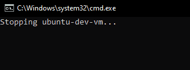
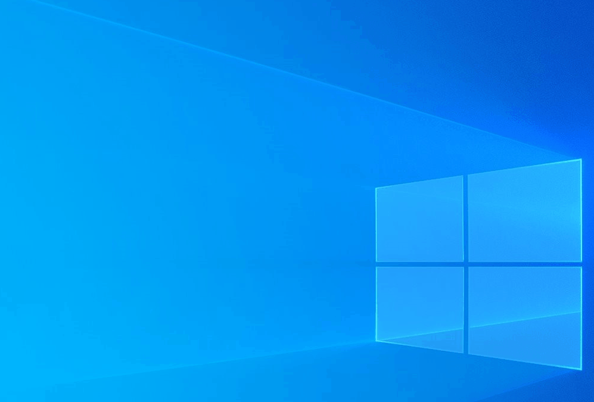

<p align="center">
    
</p>

<p align="center">
  <a href="https://hub.docker.com/r/javowiec/ubuntu-dev-vm" rel="noreferrer">
      
  </a>
</p>

## :pushpin: Introduction

Ubuntu DEV VM for Java Developers running on Windows in container.

It requires **3** dependencies:
* [**WSL version 2**](https://learn.microsoft.com/en-us/windows/wsl/install) (Windows Subsystem for Linux) - lets you install a Linux distribution and use Linux applications, utilities, and Bash command-line tools directly on Windows, unmodified, without the overhead of a traditional virtual machine or dualboot setup
* [**Docker Desktop**](https://docs.docker.com/desktop/install/windows-install/) - lets you build, share, and run containerized applications and microservices. It provides a straightforward GUI (Graphical User Interface) that lets you manage your containers, applications, and images directly from your machine
* [**MobaXterm Home Edition**](https://mobaxterm.mobatek.net/download.html) (X11 server) - lets you display applications (e.g. [IntelliJ IDEA](https://www.jetbrains.com/idea/)) from Ubuntu DEV VM on your Windows

Ubuntu DEV VM image can be pulled from DockerHub: https://hub.docker.com/r/javowiec/ubuntu-dev-vm

Container from image can be started with batch script (more in next section):



After container is started, you'll see the panel with the applications having graphical interface:


For example IntelliJ IDEA:



All applications having graphical interface (even the ones not included in the panel, e.g. [gedit text editor](https://help.gnome.org/users/gedit/stable/)) open as a separate window which you can move freely:


## :pushpin: First Setup and Start

### 1. Installation

Please follow linked official documentation and install all **3** dependencies mentioned above.

### 2. Setup

#### 2.1. WSL configuration file

You can place a `.wslconfig` file in `C:\Users\${username}` where you can configure the amount of memory or the number of logical processors you want to assign to Docker Desktop.

Example:
```
[wsl2]
memory=10GB
processors=6
swap=0
```

Full documentation: https://learn.microsoft.com/en-us/windows/wsl/wsl-config#wslconfig

#### 2.2. MobaXterm Home Edition

MobaXterm Home Edition consumes really low RAM (around 20MB, with IntelliJ IDEA open only 43,5MB RAM), so I suggest to make it run with Windows startup:
* Run `Windows Key` + `R` shortcut and type: `shell:startup`
* Add MobaXterm shortcut to `Autostart` directory
* To start MobaXterm immediately minimized into the system tray add `-hideterm` property after `MobaXterm.exe"` in the Target field in Shortcut tab

### 3. Start

Make sure MobaXterm is started. Then start Docker Desktop. After that start Ubuntu DEV VM container. Enjoy!

See example batch script which starts or restarts Ubuntu DEV VM: [restart.bat](batch-scripts/restart.bat). Change the value of `imageVersion` variable if there is newer version available.

Batch scripts can be executed on Windows in CMD/PowerShell or with double mouse click.

### 4. Quit

Quit Docker Desktop to quit Ubuntu DEV VM.

## :pushpin: Known Issues

### VHDX disk grows over time - how to shrink it?

Deleting data in Docker Desktop (e.g. images, volumes) does not cause the size of [VHDX (Virtual Hard Disk)](https://en.wikipedia.org/wiki/VHD_(file_format)) to decrease. Once the VHDX grows it will remain that size, or grow larger as the amount of data increases.

You can check the size of your Docker Desktop VHDX file under path: `%LOCALAPPDATA%\Docker\wsl\disk` (`%LOCALAPPDATA%` is Windows environment variable which resolves to `C:\Users\${username}\AppData\Local`).

If you want to recover some of the disk space on Windows that is being consumed by the VHDX, you can shrink the VHDX.

See example batch script which automates the shrinking of VHDX via [diskpart](https://learn.microsoft.com/en-us/windows-server/administration/windows-commands/diskpart) Windows utility: [shrink-vhdx.bat](batch-scripts/shrink-vhdx.bat). Change the value of `vhdxFile` variable if the name of your VHDX is different. **WARNING: Shut down Docker Desktop before running this script**.

## :pushpin: Some Useful Docs

* [Certificate Setup](docs/certificate.md)

## :pushpin: Copyright & License

Copyright (c) 2024 Marcin P. - Released under the [MIT license](LICENSE).
